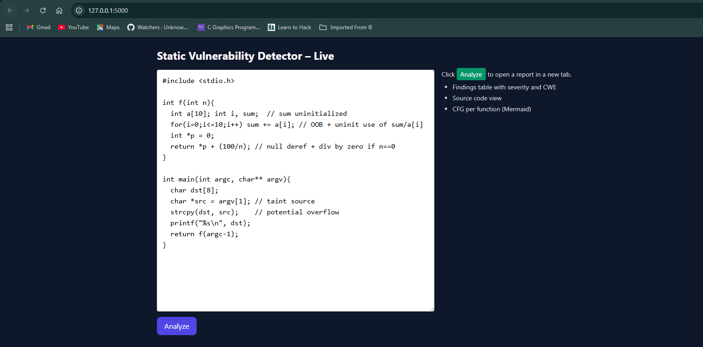
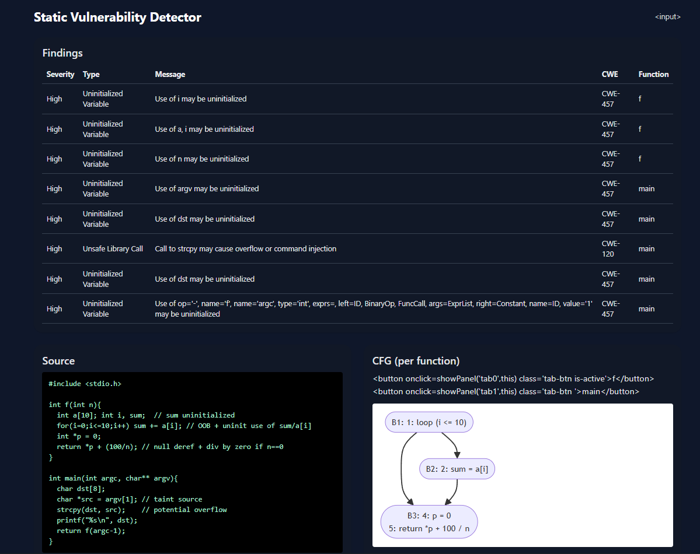

# Static Vulnerability Detector (SVD) – PCD Assignment

A complete mini-project for the **PCD (Principles of Compiler Design)** course: a **Static Vulnerability Detector** that analyzes C source code for common security issues at compile-time. It demonstrates data-flow analysis, control-flow graph construction, and static bug detection, with both a **command-line interface (CLI)** and a **visual web UI**.

---

## 🎯 Objective

* Detect classic security issues during compilation time, including:

  * **Uninitialized variable usage** (CWE-457)
  * **Unsafe library calls** (e.g., `strcpy`) (CWE-120)
  * **Potential buffer overflow / array OOB**
  * **Division by zero & null dereference**
* Build **Control Flow Graphs (CFGs)** per function.
* Show results in a professional **HTML report** and interactive **Flask web UI**.

---

## 🛠️ Features

* **CLI Tool** → analyze any C file and export an HTML report.
* **Web UI** → paste/upload code, click *Analyze*, view findings instantly.
* **Findings Table** → severity, type, CWE ID, message, function.
* **Source View** → shows original C code.
* **CFG Visualization** → per-function flowchart rendered with Mermaid.js.
* **Responsive UI** → built with TailwindCSS, works on desktop & mobile.
* **High-contrast Hover/Tab styling** → polished UI ready to demo.

---

## 🚀 Setup Instructions

### 1) Create & activate virtual environment

```bash
python -m venv .venv
# Linux/macOS
source .venv/bin/activate
# Windows PowerShell
.venv\Scripts\Activate.ps1
```

### 2) Install dependencies

```bash
pip install --upgrade pip
pip install -r requirements.txt
```

### 3) Verify installation

```bash
python -m flask --version
python -c "import pycparser, networkx; print('OK')"
```

### 4) Run CLI

```bash
# Simple run (strips includes/comments)
python -m svd.svd_cli analyze --strip svd/examples/buggy.c -o report.html
start report.html   # open on Windows
```

Or preprocess first (better for real-world code):

```bash
gcc -E svd/examples/buggy.c -o svd/examples/buggy.i
python -m svd.svd_cli analyze svd/examples/buggy.i -o report.html
```

### 5) Run Web UI

```bash
python -m svd.webui
# open browser → http://127.0.0.1:5000
```

---

## 📂 Project Structure

```
svd/
 ├─ core/
 │   ├─ parser_frontend.py   # Preprocess + strip mode for pycparser
 │   ├─ ir.py                # Intermediate representation
 │   ├─ cfg.py               # CFG builder (sanitizes for Mermaid)
 │   ├─ dataflow.py          # Dataflow + uninitialized variable analysis
 │   ├─ rules.py             # Security rules (strcpy, taint, etc.)
 │   ├─ report.py            # HTML report generator (UI improved)
 │   └─ utils.py             # Helpers
 ├─ templates/
 │   └─ editor.html          # Live web editor UI
 ├─ static/
 │   └─ styles.css           # Optional custom styles
 ├─ examples/
 │   └─ buggy.c              # Sample vulnerable C code
 ├─ requirements.txt
 ├─ svd_cli.py               # CLI entry point
 └─ webui.py                 # Flask web server
```

---

## 📊 Demo Workflow

1. Run `python -m svd.webui`
2. Open [http://127.0.0.1:5000](http://127.0.0.1:5000)
3. Paste the following sample vulnerable code:

   ```c
   #include <stdio.h>
   #include <string.h>
   int f(int n){
       int a[10], i, sum;  // uninitialized use
       for(i=0;i<=10;i++) sum += a[i];  // OOB + uninit
       int *p = 0;
       return *p + (100/n);  // null deref + div by zero
   }
   int main(int argc, char** argv){
       char dst[8];
       char *src = argv[1];
       strcpy(dst, src); // unsafe copy
   }
   ```
4. Click **Analyze** → Findings, Source, and CFGs display instantly.

---

## 📑 Deliverables for Faculty

* **Source Code** (organized, well-documented).
* **Report Output** (`report.html` for sample buggy.c).
* **Web UI Demo** (live analysis, responsive UI).
* **CFG Graphs** (auto-generated via Mermaid, tabbed per function).
* **Readme (this file)** → clear explanation of features, workflow, and how to run.

---

## ✅ Learning Outcomes

* Practical use of **lexing/parsing** (`pycparser`).
* Hands-on with **control-flow graphs & data-flow analysis**.
* Applied **static analysis & vulnerability detection** concepts.
* Built an **end-to-end compiler project** with real-world relevance.
* Showcased skills in **Flask web apps** & UI polish.

---

## 👨‍🏫 Presentation Tips

* Walk through `buggy.c` → show detected vulnerabilities.
* Switch tabs in CFG → explain control-flow visualization.
* Emphasize CWE IDs → shows industry relevance.
* Highlight responsive UI → works on mobile & desktop.
* Conclude with “This simulates a mini security analyzer integrated into a compiler.”

---

## 📌 Requirements

* Python 3.10+
* Flask 3.x
* pycparser 2.22
* networkx 3.3
* TailwindCSS (CDN)
* Mermaid.js (CDN)

---


## 🛠️ Screenshots





---